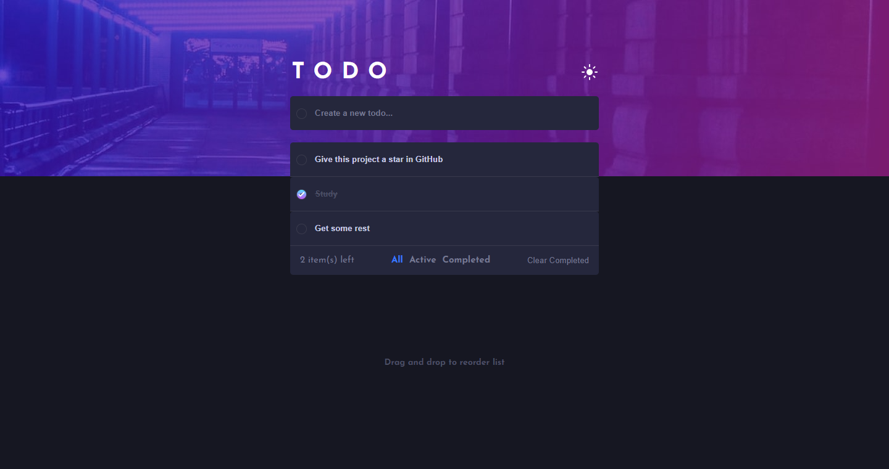
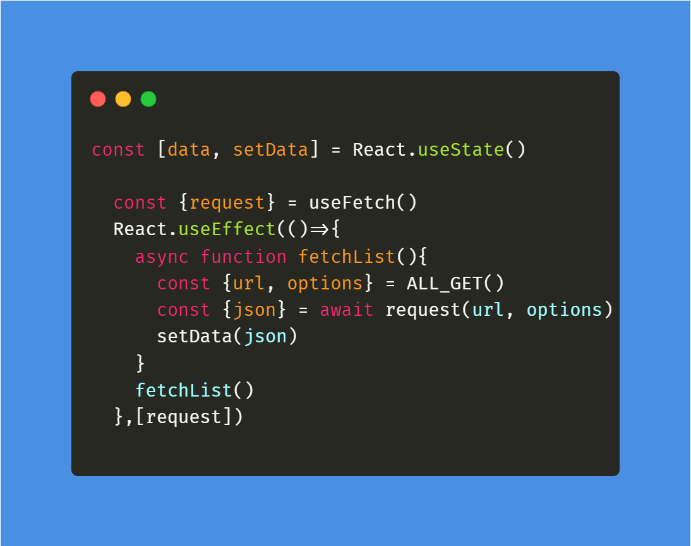
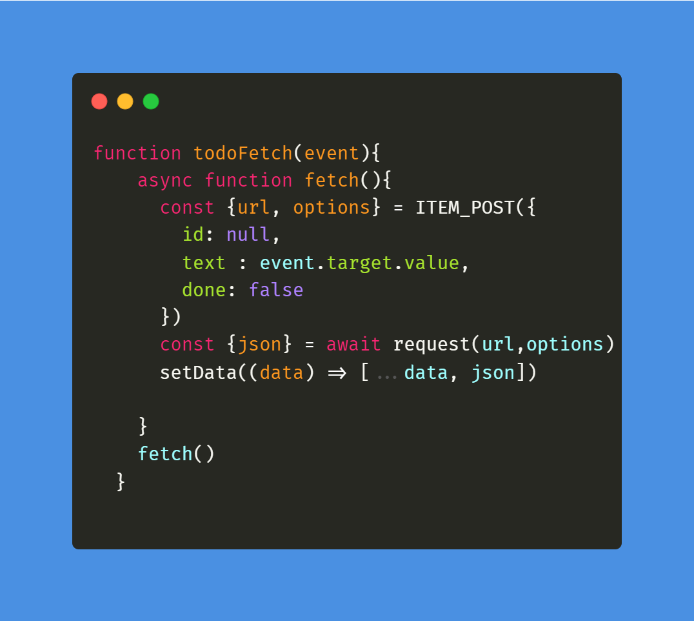

# Frontend Mentor - Todo app solution

This is a solution to the [Todo app challenge on Frontend Mentor](https://www.frontendmentor.io/challenges/todo-app-Su1_KokOW). Frontend Mentor challenges help you improve your coding skills by building realistic projects. 

## Table of contents

- [Overview](#overview)
  - [The challenge](#the-challenge)
  - [Screenshot](#screenshot)
  - [Links](#links)
- [My process](#my-process)
  - [Built with](#built-with)
  - [What I learned](#what-i-learned)
  - [Continued development](#continued-development)
  - [Useful resources](#useful-resources)
- [Author](#author)
- [Acknowledgments](#acknowledgments)

## Overview

### The challenge

Users should be able to:

- View the optimal layout for the app depending on their device's screen size
- See hover states for all interactive elements on the page
- Add new todos to the list
- Mark todos as complete
- Delete todos from the list
- Filter by all/active/complete todos
- Clear all completed todos
- Toggle light and dark mode
- **Bonus**: Drag and drop to reorder items on the list

### Screenshot

### Links

- Solution URL: [GitHub](https://github.com/Danielhu3/todo-list-react)
- Live Site URL: [Click Here](https://your-live-site-url.com)

## My process

### Built with

- Semantic HTML5 markup
- CSS custom properties
- CSS Grid
- [React](https://reactjs.org/) - JS library
- Css Modules - For styles
- JSON Server - To emulate a REST API
- React DND - Library to use Drag and Drop
- Immer - Library to work with states as if they were arrays

### About the Api
To emulate an REST API (CRUD), you must use json-server

- Installing
yarn global add json-server

- Running 
npm run json-server 

### React DND

- Installing
npm install react-dnd react-dnd-html5-backend

### Immer
- Installing
npm install immer

### What I learned

I've got some problems to update the list reactively when a new item is added. I've tried do a new fetch to get all the items from 'db.json' again when a new item is add, but, this was creating a loop, so, i create a state to store the items from list, and, when a new item is add, this will be added to this state, updating reactively.

#### Creating State on App.js

#### Updating previous state on Input.js

### Continued development

currently, the drag and drop feature only work locally and don't change the database, i intend update this to change in the database too.

## Author

- Frontend Mentor - [@Danielhu3](https://www.frontendmentor.io/profile/Danielhu3)
- Twitter - [@Danielmaggot_](https://www.twitter.com/Danielmaggot_)

